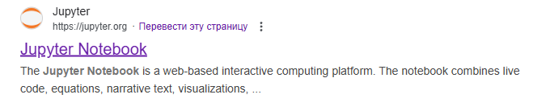
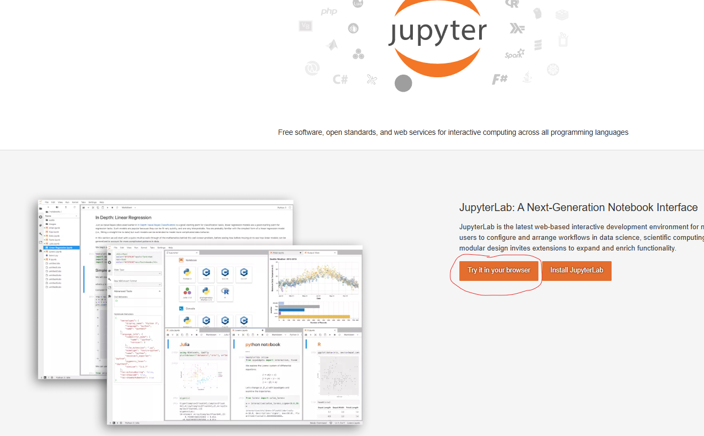
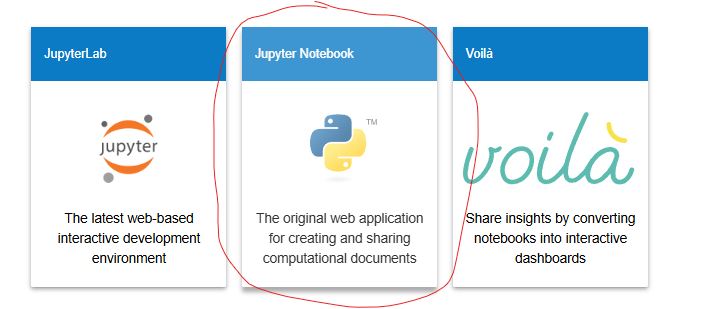
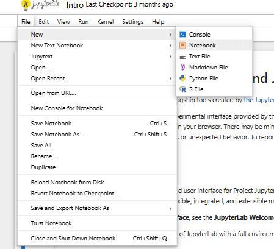
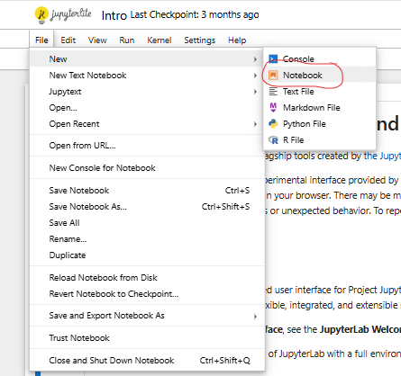
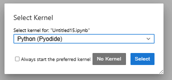
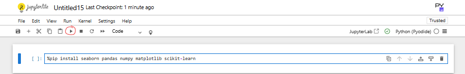
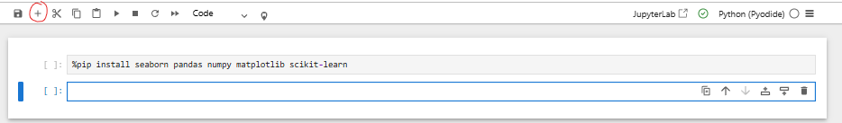
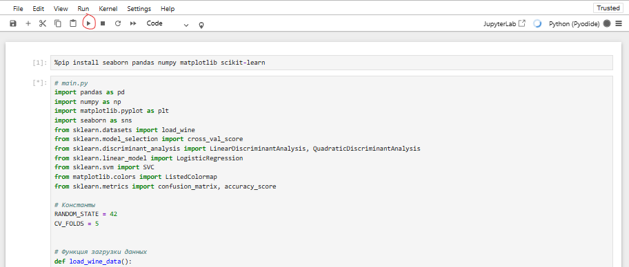
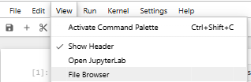

Инструкция по запуску кода через весию Jupiter Notebook в браузере.

1) Открыть браузерную версию Jupiter notebook

2) Выбрать ядро Python (Pyodide)

3) В ячейку прописать следующую команду и запустить:
%pip install seaborn pandas numpy matplotlib scikit-learn

4) Создать новую ячейку

5) Скопировать код из файла PythonProject/ForJupiterNotebook/main.py
6) Вставить его в ячейку и запустить.

7) Дождаться окончания работы программы, после чего открыть View -> File Browser.

8) В открывшемся окне найти следующие файлы:
*  pairplot.png - визуализация распределения классов на всех парах переменных .
* decision_boundaries.png - разделяющая кривая решения методами линейный и квадратичный дискриминант, логистическая регрессия, SVM (линейное и квадратичное ядро) (две переменные).
* classification_results.csv - Таблица с оценками качества классификации этими методами при помощи кросс-валидации на выбранных признаках и во всем признаковом пространстве.
* lda_visualization.png - визуализация ответов алгоритма линейного дискриминанта на всех переменных.
* lda_confusion_matrix.csv - матрица ошибок модели линейного дискриминанта.

Инструкция по запуску кода через IDE Pycharm Community

1) Склонировать репозиторий с гитхаба командой git clone https://github.com/aradust/NSU-MMAD-labs.git
2) Открыть проект в IDE Pycharm Community.
3) Запустить файл PythonProject/src/main.py
4) Аналогичые результаты можно найти в директории PythonProject/TablesAndPictures

Все файлы с исходным кодом находятся в директории PythonProject/src
В директории PythonProject/examples находятся примеры написания кода и выполнения аналогичных заданий.
В директории PythonProject/Litherature собраны некоторые теоретические материалы.
В директории PythonProject/TZ располагается описание данного задания.